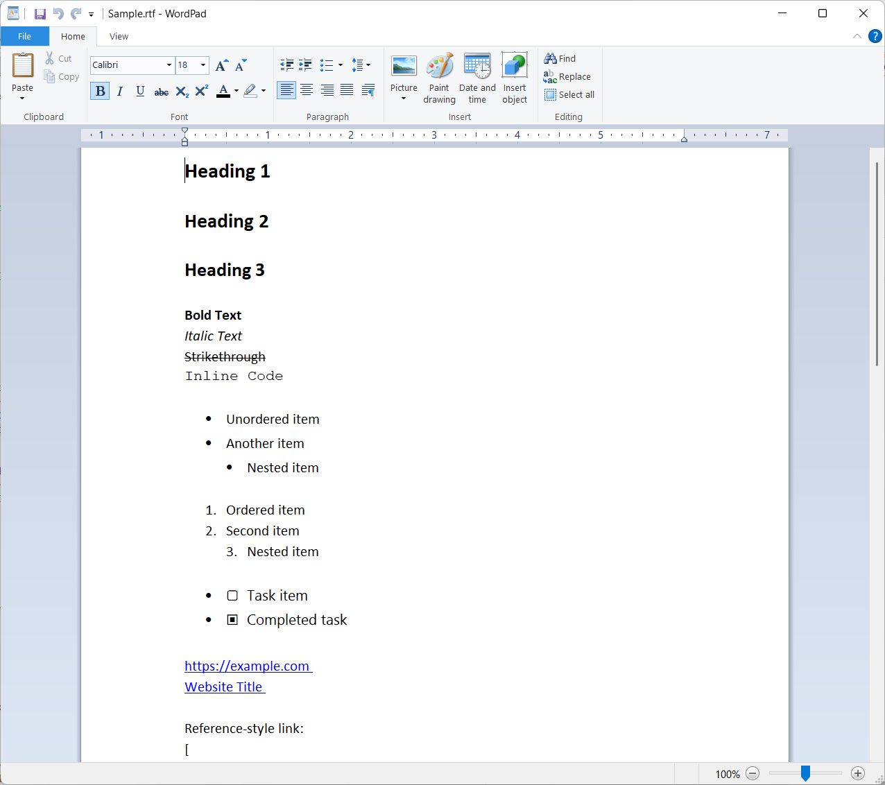
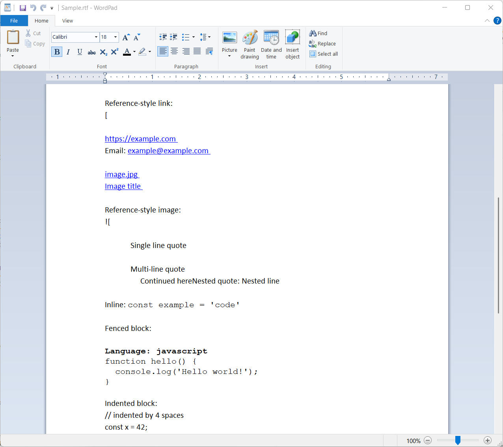
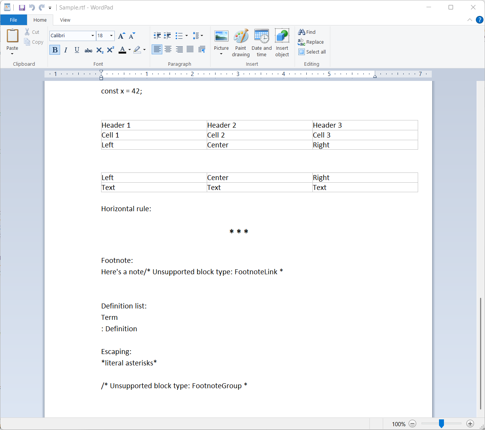

# MarkdownToRtf

The MarkdownToRtfConverter is a single-file static utility that converts Markdown to RTF using Markdig parser. 

Generates WordPad-compatible RTF with proper headers, font tables, and formatting codes. 

Supports headings, paragraphs, lists, tables, code blocks, emphasis, and hyperlinks. Easy drop-in solution for .NET apps.

**This Project is Mostly Finished, there are Markdown features that are not yet supported**

Special Thanks to the following projects:

https://github.com/GustavoHennig/MarkdownToRtf

https://github.com/snjo/MarkdownToRtf

## Quick Start

```csharp
using MarkdownToRtf;

string markdown = "# Hello World\nThis is **bold** text.";
string rtf = MarkdownToRtfConverter.ConvertRtf(markdown);
File.WriteAllText("output.rtf", rtf);
```

## Screenshots

| WordPad ScreenShot 1 | WordPad ScreenShot 2 | WordPad ScreenShot 3 |
|----------------|----------------|---------------|
|  |  |  |

## Sample Files

- **[Sample Markdown](Sample.md)** - Complete markdown example with all supported features
- **[Generated RTF](Sample.rtf)** - Corresponding RTF output that opens in WordPad

## Requirements

- Any .NET 
- Markdig NuGet package

## Installation

1. Copy `MarkdownToRtf.cs` to your project
2. Install Markdig: `dotnet add package Markdig`

## API

### `ConvertRtf(string markdown, bool includeHeaderAndFooter = true)`
Converts markdown text to RTF format.

**Parameters:**
- `markdown` - The markdown text to convert
- `includeHeaderAndFooter` - Whether to include RTF document headers (default: true)
	- This is intended for inserting RTF content into an existing RTF document.

**Returns:** RTF-formatted string

### `ConvertText(string markdown)`
Converts markdown to plain text (removes formatting).

## Supported Markdown

- **Headings** (H1-H6)
- **Text formatting** (bold, italic, strikethrough)
- **Lists** (ordered and unordered, nested)
- **Code blocks** (fenced and indented)
- **Tables**
- **Links** (inline and autolinks)
- **Blockquotes**
- **Task lists** (checkboxes)
- **Horizontal rules**
- **HTML blocks**

## Unsupported Markdown Features

The following markdown features are not yet supported and will be rendered as comments or placeholder text:

### Advanced Formatting
- **Footnotes** (`[^1]`) - Not implemented
- **Definition lists** - Not supported
- **Abbreviations** - Not supported
- **Superscript/Subscript** (`^text^`, `~text~`) - Limited support

### Mathematical Content
- **Math blocks** (`$$...$$`) - Displays as unsupported block comment
- **Inline math** (`$...$`) - Not processed
- **LaTeX expressions** - Not supported

### Media and Embeds
- **Images** (``) - Converted to placeholder text only
- **Image references** (`![alt][ref]`) - Shows reference text
- **Embedded videos** - Not supported
- **Audio files** - Not supported

### Advanced Block Types
- **Admonitions/Callouts** (`!!! note`) - Not supported
- **Mermaid diagrams** - Not supported
- **PlantUML diagrams** - Not supported
- **Custom containers** - Not supported

### GitHub Flavored Markdown Extensions
- **Emoji shortcodes** (`:smile:`) - Not processed
- **Mentions** (`@username`) - Treated as plain text
- **Issue references** (`#123`) - Treated as plain text
- **Syntax highlighting** in code blocks - Preserved but not styled

### Complex Table Features
- **Merged cells** - Not supported
- **Table captions** - Not supported
- **Complex column alignment** - Basic alignment only

### Interactive Elements
- **Collapsible sections** (`<details>`) - HTML treated as code block
- **Interactive checkboxes** - Static checkboxes only
- **Form elements** - Not supported

When unsupported blocks are encountered, they are typically:
- Rendered as `/* Unsupported block type: [BlockName] */` comments
- Converted to plain text where possible
- Preserved as-is in code blocks for HTML content

**Contributions welcome!** If you need support for any of these features, please consider contributing to the project or opening an issue.

## Examples

### Basic Usage
```csharp
string markdown = @"
# Document Title
This is a **bold** statement with *italic* text.

## List Example
- Item 1
- Item 2
  1. Nested item
  2. Another nested item

[Link to example](https://example.com)
";

string rtf = MarkdownToRtfConverter.ConvertRtf(markdown);
```

### Without RTF Headers
```csharp
// Generate RTF content only (no document wrapper)
string rtfContent = MarkdownToRtfConverter.ConvertRtf(markdown, false);
```

### Configuration
```csharp
// Control empty paragraphs between blocks
MarkdownToRtfConverter.UseEmptyParagraph = false;
```

## WordPad RTF Formatting

The converter generates RTF that follows WordPad's formatting standards for optimal compatibility:

### Font Configuration
- **Primary Font**: Calibri (`\f0`) - Used for standard text and headings
- **Monospace Font**: Courier New (`\f1`) - Used for code blocks and inline code
- **Symbol Font**: Symbol (`\f2`) - Used for special characters and bullets

### Heading Sizes (in half-points)
- **H1**: 36pt (fs72) - Large, bold headings
- **H2**: 35pt (fs70) - Section headings
- **H3**: 34pt (fs68) - Subsection headings
- **H4**: 33pt (fs66) - Minor headings
- **H5**: 32pt (fs64) - Small headings
- **H6**: 31pt (fs62) - Smallest headings
- **Default**: 12.5pt (fs25) - Standard paragraph text

### Line Spacing
- **Standard**: 1.15x spacing (`\sl276\slmult1`) for readability
- **Lists**: Proper indentation with 360 twips per level
- **Code blocks**: Monospace formatting with preserved whitespace

### Special Features

#### Lists
- **Unordered**: Uses bullet symbols (`\f2\'B7`) with proper indentation
- **Ordered**: Auto-numbered with decimal formatting (`\pndec`)
- **Nested**: Supports multiple indent levels (360 twips increment)

#### Tables
- **Cell padding**: 10 twips (`\trgaph10`)
- **Border spacing**: Consistent cell boundaries
- **Column width**: Auto-calculated based on content

#### Hyperlinks
- **Field codes**: Uses RTF HYPERLINK fields for clickable links
- **Formatting**: Underlined text with proper URL encoding
- **Compatibility**: Works in WordPad, Word, and most RTF readers

#### Task Lists
- **Checked**: White square with black center (`\u9635`)
- **Unchecked**: Empty white square (`\u9634`)

### WordPad Testing

To verify RTF output in WordPad:

1. Generate RTF using the converter
2. Save to `.rtf` file
3. Open in WordPad (Start → WordPad)
4. Verify formatting appears correctly:
   - Headers should display in increasing font sizes
   - Lists should have proper bullets/numbers and indentation
   - Code blocks should use monospace font
   - Links should be clickable and underlined
   - Tables should display with proper cell boundaries

### RTF Structure

Generated RTF follows this structure:
```
{\rtf1\ansi\ansicpg1252\deff0\nouicompat
{\fonttbl{\f0\fnil\fcharset0 Calibri;}{\f1\fnil\fcharset0 Courier New;}{\f2\fnil\fcharset2 Symbol;}}
{\*\generator Riched20 10.0.26100}\viewkind4\uc1
[Content with proper paragraph and character formatting]
}
```

## Output

The generated RTF includes:
- RTF 1.0 specification headers
- Font table (Calibri, Courier New, Symbol)
- Proper paragraph and character formatting
- Compatible with WordPad and most RTF readers
- Unicode character support for special symbols
- Hyperlink field codes for clickable links

## License

MIT License

---

## RTF Document Format Reference

RTF (Rich Text Format) is a document file format developed by Microsoft for cross-platform document exchange. RTF documents use control codes to define formatting, layout, and content structure.

### RTF Document Structure

RTF documents follow a hierarchical structure with groups enclosed in curly braces `{}`. Each document has this basic structure:

```
{\rtf1 [charset] [document properties] [font table] [color table] [content]}
```

### Document Header

#### RTF Version and Encoding
```
\rtf1                    - RTF version 1.0
\ansi                    - ANSI character set
\ansicpg1252            - ANSI code page 1252 (Windows Latin-1)
\deff0                  - Default font is font 0
\nouicompat             - No UI compatibility mode
```

#### Font Table Definition
The font table defines all fonts used in the document:
```
{\fonttbl
{\f0\fnil\fcharset0 Calibri;}          - Font 0: Calibri, default charset
{\f1\fnil\fcharset0 Courier New;}      - Font 1: Courier New (monospace)
{\f2\fnil\fcharset2 Symbol;}           - Font 2: Symbol font
}
```

**Font Family Types:**
- `\fnil` - Default/unknown family
- `\froman` - Roman (serif) fonts
- `\fswiss` - Swiss (sans-serif) fonts
- `\fmodern` - Modern (monospace) fonts
- `\fscript` - Script fonts
- `\fdecor` - Decorative fonts

#### Generator Information
```
{\*\generator Riched20 10.0.26100}     - Generated by RichEdit control
\viewkind4                              - Normal view
\uc1                                    - Unicode character count
```

### Character Formatting Codes

#### Font Selection
```
\f0                     - Switch to font 0 (Calibri)
\f1                     - Switch to font 1 (Courier New)
\f2                     - Switch to font 2 (Symbol)
```

#### Font Size (in half-points)
```
\fs24                   - 12 point font (24 half-points)
\fs25                   - 12.5 point font (default text)
\fs32                   - 16 point font
\fs72                   - 36 point font (H1 heading)
```

#### Text Formatting
```
\b                      - Bold on
\b0                     - Bold off
\i                      - Italic on
\i0                     - Italic off
\ul                     - Underline on
\ul0                    - Underline off
\strike                 - Strikethrough on
\strike0                - Strikethrough off
```

### Paragraph Formatting Codes

#### Basic Paragraph Structure
```
\pard                   - Reset paragraph formatting to defaults
\par                    - End paragraph (paragraph break)
```

#### Line Spacing
```
\sl240                  - Single line spacing (240 twips)
\sl276                  - 1.15x line spacing (276 twips)
\sl360                  - 1.5x line spacing (360 twips)
\sl480                  - Double line spacing (480 twips)
\slmult1                - Line spacing multiplier
```

#### Paragraph Alignment
```
\ql                     - Align left (default)
\qc                     - Align center
\qr                     - Align right
\qj                     - Justify
```

#### Indentation (in twips, 1 inch = 1440 twips)
```
\li720                  - Left indent 720 twips (0.5 inch)
\ri720                  - Right indent 720 twips
\fi-360                 - First line indent -360 twips (hanging indent)
```

### List Formatting Codes

#### Bullet Lists
```
{\pntext\f2\'B7\tab}                   - Bullet character and tab
{\*\pn\pnlvlblt\pnf2\pnindent0{\pntxtb\'B7}}  - Bullet list definition
\fi-360\li720                          - Hanging indent for list items
```

#### Numbered Lists
```
{\pntext\f0 1.\tab}                    - Number text and tab
{\*\pn\pnlvlbody\pnf0\pnindent0\pnstart1\pndec{\pntxta.}} - Numbered list definition
\pnstart1                              - Start numbering at 1
\pndec                                 - Decimal numbering
```

### Table Formatting Codes

#### Table Structure
```
\trowd                  - Table row defaults
\trgaph10              - Table row gap (cell padding)
\trpaddl10             - Left cell padding
\trpaddr10             - Right cell padding
\cellx2000             - Cell boundary at 2000 twips
\intbl                 - Text is inside table
\cell                  - End of cell
\row                   - End of table row
```

### Hyperlink Codes

#### Field-based Hyperlinks
```
{\field                                 - Start field
{\*\fldinst{HYPERLINK "url"}}          - Field instruction with URL
{\fldrslt link text}                   - Field result (visible text)
}                                      - End field
```

### Special Characters and Unicode

#### Special Character Escaping
```
\\                      - Literal backslash
\{                      - Literal left brace
\}                      - Literal right brace
```

#### Line Breaks and Spacing
```
\line                   - Manual line break (soft return)
\page                   - Page break
\tab                    - Tab character
```

#### Unicode Characters
```
\u9635?                 - Unicode character 9635 (☑ checked box)
\u9634?                 - Unicode character 9634 (☐ unchecked box)
\'B7                    - Hexadecimal character B7 (• bullet)
```

### Document Termination
```
}                       - Close main document group
```

### Units of Measurement

RTF uses **twips** (twentieth of a point) as the primary unit:
- 1 inch = 1440 twips
- 1 centimeter = 567 twips  
- 1 point = 20 twips
- 1 pica = 240 twips

### Example RTF Document

Here's a complete minimal RTF document:
```
{\rtf1\ansi\deff0
{\fonttbl{\f0 Times New Roman;}}
\f0\fs24 Hello \b bold \b0 world!\par
}
```

This creates a document with "Hello **bold** world!" where "bold" appears in bold formatting.

### Best Practices

1. **Always escape special characters** (`\`, `{`, `}`)
2. **Close all formatting codes** (e.g., `\b` followed by `\b0`)
3. **Use consistent font references** (define in font table first)
4. **End paragraphs with `\par`**
5. **Reset paragraph formatting with `\pard` when needed**
6. **Use proper nesting of groups** with matching braces
7. **Include Unicode fallback characters** for special symbols
